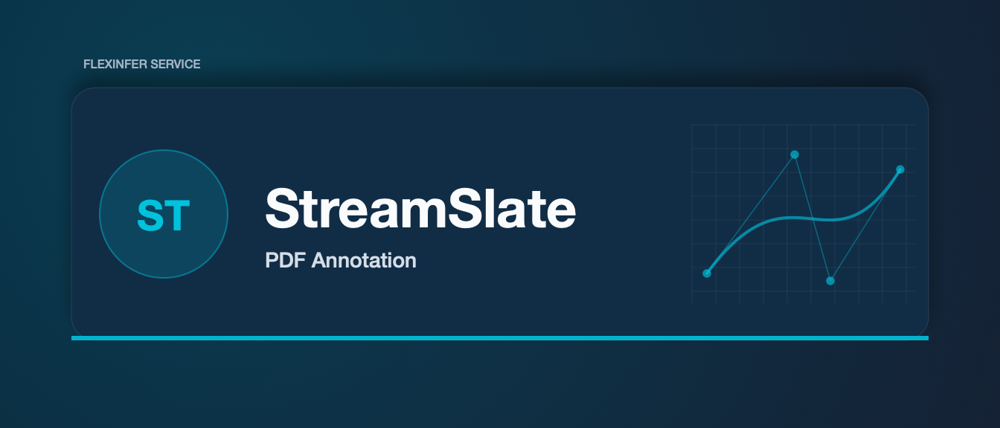

# StreamSlate

Mark it. Show it. – A lightning-fast PDF annotator built specifically for streamers, YouTubers, and on-air educators.

  
  
  

⸻

✨ Why StreamSlate?

Teaching live, reacting to research papers, or breaking down patch notes on stream usually means fumbling with clunky viewers or overlay hacks. StreamSlate gives you a purpose-built workspace that:
• Stays invisible until you need it – auto-hiding chrome and a one-click Presenter Mode keep the focus on content, not UI.
• Loves the dark – true dark-mode page inversion + neon/pastel highlight palette pop on camera without glare.
• Plugs straight into OBS / StreamYard / vMix – local WebSocket server and optional NDI output make scene setup trivial.
• Runs light – powered by Tauri + PDF.js; <10 MB install and <80 MB RAM with a 100-page PDF.

⸻

🚀 Feature Highlights

Category What you get Status
✏️ Annotations Highlight • underline • free-ink • shapes • call-outs ✅
🌙 Dark-First UI Adaptive page inversion, WCAG-contrast color swatches ✅
🎥 Presenter Mode Borderless window/Browser Source, transparent bg toggle 🛠️
🖥️ OBS / Stream Deck Global hotkeys + plug-in, WebSocket control 🛠️
🌐 Collaboration Live cursors & comments for co-hosts 🔜 Planned
📦 Export Embed annotations back into PDF or JSON layer 🔜 Planned

⸻

🖥️ Quick Start

Using Pre-built Releases 1. Grab the latest .dmg / .msi / .AppImage from Releases. 2. Install and launch StreamSlate. 3. Drag a PDF onto the window or run:

streamslate MyDeck.pdf

    4.	In OBS, Add → Browser Source pointing to http://localhost:11451/presenter?token=YOUR_TOKEN.

Building From Source

Requires Node ≥ 20, cargo + Rust stable, and make.

git clone https://github.com/streamslate/streamslate.git
cd streamslate
npm install
npm run tauri dev # hot-reload during development

The first build will compile the Tauri (Rust) side – subsequent runs are much faster.

⸻

🎛️ Integration Guide

Tool Steps
OBS Studio Install OBS WebSocket 5.x → Add Browser Source with the Presenter URL (auto-generated in StreamSlate → Integrations panel)
Stream Deck Install the official StreamSlate plug-in → Map actions like Next Page, Toggle Highlighter, Clean Mode
vMix / NDI Enable NDI Output in Settings → Presenter and add it as an NDI source
Shortcuts / Automations Every function is exposed over a local REST WebSocket API (ws://localhost:11451) – see docs/api.md

⸻

🗺️ Roadmap
• MVP – Dark viewer, highlighter, OBS browser source
• Beta – Annotation save/export, Stream Deck plug-in
• 1.0 – Live collaboration, NDI/Syphon, auto-update
• Mobile companion (iPad side-car)

See more in ROADMAP.md. Have a feature request? Open an issue or vote on the board!

⸻

🤝 Contributing

We 💜 pull requests! Check out CONTRIBUTING.md for code style, commit message conventions (Conventional Commits), and the contributor license agreement.

# bootstrap a dev shell

npm run dev:setup

# run linter & tests before pushing

npm run test && npm run lint

⸻

📄 License

StreamSlate is dual-licensed under GPL-3.0 and a commercial license for creators who need to distribute closed-source binaries. See LICENSE for details.

⸻

🙏 Credits

Built with ❤️ on top of:
• Tauri – tiny, secure, Rust-powered desktop framework
• PDF.js – battle-tested PDF renderer
• pdf-lib – annotation embedding
• Konva – GPU-accelerated canvas editing

⸻

&copy; 2025 StreamSlate LLC – Made for creators, by creators.

