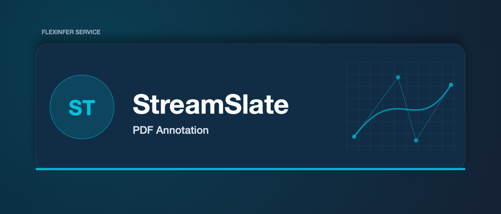

# StreamSlate

Mark it. Show it. – A lightning-fast PDF annotator built specifically for streamers, YouTubers, and on-air educators.

  
  
  

⸻

✨ Why StreamSlate?

Teaching live, reacting to research papers, or breaking down patch notes on stream usually means fumbling with clunky viewers or overlay hacks. StreamSlate gives you a purpose-built workspace that:
• Stays invisible until you need it – auto-hiding chrome and a one-click Presenter Mode keep the focus on content, not UI.
• Loves the dark – dark-first UI with stream-optimized neon/pastel palettes that pop on camera without glare.
• Plugs into your streaming stack – local WebSocket API makes OBS Browser Source setup and remote control trivial.
• Runs light – powered by Tauri + PDF.js; <10 MB install and <80 MB RAM with a 100-page PDF.

⸻

🚀 Feature Highlights

Category What you get Status
✏️ Annotations Highlight • free-ink • shapes • arrows • text call-outs ✅
🌙 Dark-First UI Dark chrome with stream-optimized color palettes ✅
🎥 Presenter Mode Borderless window, transparent background toggle ✅
🌐 WebSocket API Remote page, zoom, presenter, and annotation control via `ws://127.0.0.1:11451` ✅
📦 Export Embed annotations back into PDF or export as JSON ✅
🎨 Presets & Templates Annotation preset library + use-case templates ✅
📡 NDI & Syphon Output Native video output (build-time opt-in; requires NDI SDK / Syphon.framework) ✅
🖥️ Multi-Monitor Capture Pick any display for native screen capture (macOS) ✅
☁️ Settings Sync Export/import all settings as portable JSON ✅
🔄 Auto-Update Built-in update checker with one-click install ✅

⸻

🖥️ Quick Start

Using Pre-built Releases 1. Grab the latest .dmg / .msi / .AppImage from Releases. 2. Install and launch StreamSlate. 3. Drag a PDF onto the window or run:

streamslate MyDeck.pdf

    4.	In OBS, Add → Browser Source pointing to http://localhost:11451/presenter.

Building From Source

Requires Node ≥ 20, cargo + Rust stable, and make.

git clone https://github.com/streamslate/streamslate.git
cd streamslate
npm install
npm run tauri:dev # hot-reload during development

The first build will compile the Tauri (Rust) side – subsequent runs are much faster.

⸻

🎛️ Integration Guide

Tool Steps
OBS Studio Add a Browser Source pointing to `http://localhost:11451/presenter` for a clean overlay view
WebSocket API Control page navigation, zoom, presenter mode, and annotations over `ws://127.0.0.1:11451` – see [docs/api.md](docs/api.md)
NDI / Syphon Enable NDI or Syphon output for native video feed to receivers (build-time opt-in; requires NDI SDK or Syphon.framework on macOS)
Automation Any WebSocket client can send commands – build custom Stream Deck profiles, scripts, or companion apps using the [API reference](docs/api.md)

⸻

🗺️ Roadmap
• MVP – Dark viewer, highlighter, OBS browser source
• Beta – Annotation save/export, WebSocket remote control
• 1.0 – Cross-platform builds, auto-update, Cypress E2E ✅
• 1.1 – Presets/templates, annotation toolbar, Syphon scaffolding ✅
• 1.2+ – NDI & Syphon output, multi-monitor capture, portable settings sync ✅
• Next – PDF page inversion, OBS WebSocket integration, mobile companion

See more in ROADMAP.md. Have a feature request? Open an issue or vote on the board!

⸻

🤝 Contributing

We 💜 pull requests! Check out CONTRIBUTING.md for code style, commit message conventions (Conventional Commits), and the contributor license agreement.

# install dependencies

npm ci

# start the desktop app in dev mode

npm run tauri:dev

# run linter & tests before pushing

npm run test:unit && npm run test:headless && npm run lint

⸻

📄 License

StreamSlate is dual-licensed under GPL-3.0 and a commercial license for creators who need to distribute closed-source binaries. See LICENSE for details.

⸻

🙏 Credits

Built with ❤️ on top of:
• Tauri – tiny, secure, Rust-powered desktop framework
• PDF.js – battle-tested PDF renderer
• pdf-lib – annotation embedding
• Konva – GPU-accelerated canvas editing

⸻

&copy; 2025–2026 StreamSlate LLC – Made for creators, by creators.

