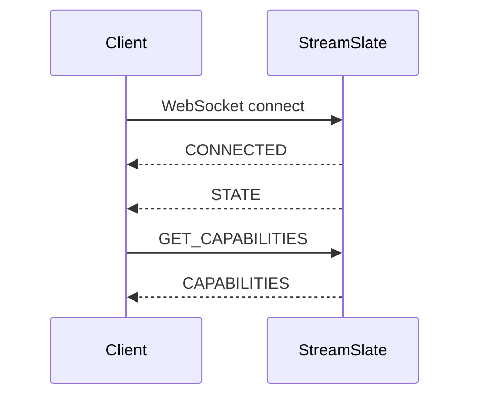

# StreamSlate API V2 Contract

This document defines the V2 local-control contract for implementation handoff.
It is a compatibility target for local automation and future integration agents.
It does not claim OBS, Stream Deck, sync, mobile, or cloud integrations are
shipped.

Current runtime behavior is documented in [Local API](api.md). V2
implementations must preserve the v1 command and event names while adding
version and capability discovery.

## Status

- Protocol version: `2.0`
- Transport: WebSocket JSON
- Endpoint: `ws://127.0.0.1:11451`
- Binding: loopback-only unless a future pairing flow changes the trust model
- Compatibility baseline: current v1 clients that send only `type` and command
  parameters continue to work
- Shipped runtime behavior: accepts optional `protocolVersion: "2.0"` and
  `request_id` metadata on commands, supports `GET_CAPABILITIES`, echoes
  `request_id` on direct V2 responses where runtime support is present, exposes
  `CAPABILITIES` to TypeScript integration listeners, and peer-broadcasts
  annotation mutation events
- Discovery: clients use `GET_CAPABILITIES` and fall back to v1 behavior if an
  older runtime returns `ERROR` or closes the connection
- Fixtures: concrete JSON examples live in
  [`api-v2-fixtures/`](api-v2-fixtures/)

## Transport

Clients connect to the local WebSocket server and exchange one JSON object per
WebSocket text message. Message types use `SCREAMING_SNAKE_CASE` in the `type`
field.

The server currently sends `CONNECTED` and `STATE` after a connection opens.
V2 servers should keep that handshake for v1 compatibility. A V2-aware client
should send `GET_CAPABILITIES` after connection before enabling optional
behavior.



## Message Envelope

Every command and event has a `type` string. V2 clients may include
`protocolVersion` and `request_id` on commands. V2 servers should echo
`request_id` on direct responses when present.

```json
{
  "type": "GET_STATE",
  "protocolVersion": "2.0",
  "request_id": "obs-42"
}
```

Compatibility rules:

- V1 command shapes remain valid without `protocolVersion` or `request_id`.
- Clients must ignore unknown event fields.
- Servers must ignore unknown command fields unless the command cannot be
  executed safely.
- New command and event names must not change the semantics of existing names.

## Commands

### NEXT_PAGE

Move to the next page when a PDF is loaded.

```json
{
  "type": "NEXT_PAGE"
}
```

Expected direct response:

```json
{
  "type": "PAGE_CHANGED",
  "page": 6,
  "total_pages": 20
}
```

### PREVIOUS_PAGE

Move to the previous page when a PDF is loaded.

```json
{
  "type": "PREVIOUS_PAGE"
}
```

Expected direct response:

```json
{
  "type": "PAGE_CHANGED",
  "page": 4,
  "total_pages": 20
}
```

### GO_TO_PAGE

Move to a 1-based page number.

```json
{
  "type": "GO_TO_PAGE",
  "page": 5
}
```

Parameters:

| Field  | Type    | Required | Notes                                        |
| ------ | ------- | -------- | -------------------------------------------- |
| `page` | integer | yes      | 1-based page number in the loaded PDF range. |

Expected direct response: `PAGE_CHANGED` or `ERROR`.

### GET_STATE

Return the current state snapshot.

```json
{
  "type": "GET_STATE"
}
```

Expected direct response: `STATE`.

### SET_ZOOM

Set the document zoom level.

```json
{
  "type": "SET_ZOOM",
  "zoom": 1.25
}
```

Parameters:

| Field  | Type   | Required | Notes                                |
| ------ | ------ | -------- | ------------------------------------ |
| `zoom` | number | yes      | Scale factor where `1.0` means 100%. |

Expected direct response:

```json
{
  "type": "ZOOM_CHANGED",
  "zoom": 1.25
}
```

The current runtime clamps zoom to its supported range. V2 implementations
should document the advertised range in capabilities when that range becomes
stable.

### TOGGLE_PRESENTER

Toggle presenter mode.

```json
{
  "type": "TOGGLE_PRESENTER"
}
```

Expected direct response:

```json
{
  "type": "PRESENTER_CHANGED",
  "active": true
}
```

### PING

Application-level keepalive.

```json
{
  "type": "PING"
}
```

Expected direct response:

```json
{
  "type": "PONG"
}
```

This is separate from WebSocket protocol ping/pong frames.

### ADD_ANNOTATION

Add one annotation to a 1-based page number.

```json
{
  "type": "ADD_ANNOTATION",
  "page": 5,
  "annotation": {
    "id": "ann-1",
    "kind": "rectangle",
    "x": 128,
    "y": 96,
    "width": 320,
    "height": 180,
    "color": "#ff3355"
  }
}
```

Parameters:

| Field        | Type    | Required | Notes                                  |
| ------------ | ------- | -------- | -------------------------------------- |
| `page`       | integer | yes      | 1-based page number.                   |
| `annotation` | object  | yes      | JSON payload preserved by StreamSlate. |

Expected direct response:

```json
{
  "type": "ANNOTATIONS_UPDATED",
  "annotations": {
    "5": [
      {
        "id": "ann-1",
        "kind": "rectangle",
        "x": 128,
        "y": 96,
        "width": 320,
        "height": 180,
        "color": "#ff3355"
      }
    ]
  }
}
```

V2 should keep annotation payloads JSON-compatible and reject payloads that
cannot be serialized.

This is a state-changing response. The requesting client receives the direct
`ANNOTATIONS_UPDATED` response, and other connected peers receive
`ANNOTATIONS_UPDATED` as a broadcast state change.

### CLEAR_ANNOTATIONS

Clear all annotations.

```json
{
  "type": "CLEAR_ANNOTATIONS"
}
```

Expected direct response:

```json
{
  "type": "ANNOTATIONS_CLEARED"
}
```

This is a state-changing response. The requesting client receives the direct
`ANNOTATIONS_CLEARED` response, and other connected peers receive
`ANNOTATIONS_CLEARED` as a broadcast state change.

### GET_CAPABILITIES

Return protocol and feature discovery metadata. In the shipped runtime this is
loopback-only local-control discovery; it is not a remote pairing, cloud sync,
OBS, Stream Deck, or mobile feature.

```json
{
  "type": "GET_CAPABILITIES",
  "protocolVersion": "2.0",
  "request_id": "deck-hello"
}
```

Expected direct response: `CAPABILITIES` on V2-capable runtimes, or a
v1-compatible `ERROR` when an older runtime does not implement the command.

`CAPABILITIES` is observable by TypeScript integration listeners after the
client stores the negotiated capability state. It is a direct discovery
response, not a peer-broadcast state change.

## Events

### CONNECTED

Sent when the WebSocket connection is accepted.

```json
{
  "type": "CONNECTED",
  "version": "1.5.0"
}
```

V2 servers may add `protocolVersion: "2.0"` after implementation. Clients must
not require it on `CONNECTED`; use `GET_CAPABILITIES` for authoritative
discovery.

### STATE

State snapshots include the stable fields below.

```json
{
  "type": "STATE",
  "page": 5,
  "total_pages": 20,
  "zoom": 1.25,
  "pdf_loaded": true,
  "pdf_path": "/Users/example/Deck.pdf",
  "pdf_title": "Deck",
  "presenter_active": false
}
```

| Field              | Type           | Notes                                |
| ------------------ | -------------- | ------------------------------------ |
| `page`             | integer        | Current 1-based page number.         |
| `total_pages`      | integer        | Page count for the loaded PDF.       |
| `zoom`             | number         | Scale factor where `1.0` means 100%. |
| `pdf_loaded`       | boolean        | `true` when a PDF is loaded.         |
| `pdf_path`         | string or null | Local path when available.           |
| `pdf_title`        | string or null | Display title when available.        |
| `presenter_active` | boolean        | Presenter mode state.                |

These fields are the minimum V2 state contract.

### PAGE_CHANGED

```json
{
  "type": "PAGE_CHANGED",
  "page": 5,
  "total_pages": 20
}
```

### PDF_OPENED

```json
{
  "type": "PDF_OPENED",
  "path": "/Users/example/Deck.pdf",
  "title": "Deck",
  "page_count": 20
}
```

### PDF_CLOSED

```json
{
  "type": "PDF_CLOSED"
}
```

### ZOOM_CHANGED

```json
{
  "type": "ZOOM_CHANGED",
  "zoom": 1.25
}
```

### PRESENTER_CHANGED

```json
{
  "type": "PRESENTER_CHANGED",
  "active": true
}
```

### ANNOTATIONS_UPDATED

```json
{
  "type": "ANNOTATIONS_UPDATED",
  "annotations": {
    "5": [
      {
        "id": "ann-1",
        "kind": "rectangle"
      }
    ]
  }
}
```

The `annotations` object maps page numbers to arrays. JSON object keys are
strings, so clients should parse page keys as positive integers.

When produced by `ADD_ANNOTATION`, the requesting client receives a direct
response that may include V2 metadata such as `request_id`. Other connected
clients receive the event as a peer broadcast without request-specific metadata.

### ANNOTATIONS_CLEARED

```json
{
  "type": "ANNOTATIONS_CLEARED"
}
```

When produced by `CLEAR_ANNOTATIONS`, the requesting client receives a direct
response that may include V2 metadata such as `request_id`. Other connected
clients receive the event as a peer broadcast without request-specific metadata.

### PONG

```json
{
  "type": "PONG"
}
```

### ERROR

The current runtime emits a message-only error. V2 keeps that shape valid and
allows richer metadata.

Minimum supported shape:

```json
{
  "type": "ERROR",
  "message": "No PDF is currently open"
}
```

Recommended V2 shape:

```json
{
  "type": "ERROR",
  "protocolVersion": "2.0",
  "request_id": "obs-42",
  "code": "PDF_NOT_LOADED",
  "message": "No PDF is currently open",
  "recoverable": true,
  "details": {
    "command": "NEXT_PAGE"
  }
}
```

Error guidance:

- `message` is required for all versions.
- `code` should be stable and machine-readable when present.
- `request_id` should match the command when present.
- `recoverable` tells automation clients whether retrying after state changes is
  reasonable.
- `details` must contain JSON-compatible diagnostic data only.

## Capabilities

`CAPABILITIES` is the V2 discovery response and an observable integration event.

```json
{
  "type": "CAPABILITIES",
  "protocolVersion": "2.0",
  "supported_commands": [
    "NEXT_PAGE",
    "PREVIOUS_PAGE",
    "GO_TO_PAGE",
    "GET_STATE",
    "SET_ZOOM",
    "TOGGLE_PRESENTER",
    "PING",
    "ADD_ANNOTATION",
    "CLEAR_ANNOTATIONS",
    "GET_CAPABILITIES"
  ],
  "supported_events": [
    "STATE",
    "PAGE_CHANGED",
    "PDF_OPENED",
    "PDF_CLOSED",
    "ZOOM_CHANGED",
    "PRESENTER_CHANGED",
    "ERROR",
    "PONG",
    "CONNECTED",
    "ANNOTATIONS_UPDATED",
    "ANNOTATIONS_CLEARED",
    "CAPABILITIES"
  ],
  "features": ["presenter", "annotations", "pdf_state", "websocket_control"]
}
```

Clients should treat absent capability fields as unknown, not false. A v1
server may return `ERROR` for `GET_CAPABILITIES`; that means clients should use
the current API documented in [Local API](api.md).

The TypeScript integration client dispatches valid `CAPABILITIES` payloads to
registered handlers after updating connection state. Servers should not
broadcast `CAPABILITIES` to peers because discovery does not mutate shared
document state.

## Backwards Compatibility

V2 is additive.

- Existing commands keep their names, parameters, and direct response event
  families.
- Existing events keep their field names.
- `STATE` keeps the V2 minimum state fields even when a value is null.
- Message-only `ERROR` remains valid.
- Unknown event fields are ignored by clients.
- Unknown command fields are ignored by servers when safe.
- OBS, Stream Deck, mobile, and sync clients must negotiate through
  capabilities instead of assuming optional features.

## Fixture Expectations

The V2 contract fixtures are checked in under
[`docs/api-v2-fixtures/`](api-v2-fixtures/). They prove the public JSON shapes
without requiring the Tauri app to run.

Fixture groups:

| Fixture                            | Purpose                                      |
| ---------------------------------- | -------------------------------------------- |
| `connected.v1.json`                | Current `CONNECTED` handshake shape.         |
| `state.loaded.v2.json`             | Loaded-PDF state with all V2 minimum fields. |
| `state.empty.v2.json`              | No-PDF state with null path/title values.    |
| `capabilities.v2.json`             | Full `CAPABILITIES` discovery payload.       |
| `error.v1.json`                    | Message-only compatibility error.            |
| `error.v2.json`                    | Rich V2 error envelope.                      |
| `command.go-to-page.v1.json`       | Existing minimal command shape.              |
| `command.get-capabilities.v2.json` | V2 discovery command shape.                  |
| `annotations-updated.v2.json`      | Annotation map with string page keys.        |
| `annotations-cleared.v2.json`      | Annotation-cleared state-change event.       |

Fixture checks verify:

- JSON parses without comments.
- `type` names match the documented command and event names.
- `protocolVersion`, when present, is exactly `"2.0"`.
- State fixtures include `page`, `total_pages`, `zoom`, `pdf_loaded`,
  `pdf_path`, `pdf_title`, and `presenter_active`.
- V1 fixtures remain accepted by V2 parsers.
- V2 clients can downgrade when `GET_CAPABILITIES` is unsupported.

## Implementation Notes For Integration Agents

Integration agents should start with `GET_CAPABILITIES`, then bind only to
commands listed in `supported_commands`. They should keep their first supported
feature set to local WebSocket control and avoid OBS, Stream Deck, cloud, or
mobile assumptions unless a future contract explicitly advertises those
capabilities.

Sync and mobile agents should treat loopback-only transport as a hard boundary.
Remote pairing, authentication, or relay behavior requires a future contract
revision before implementation.
